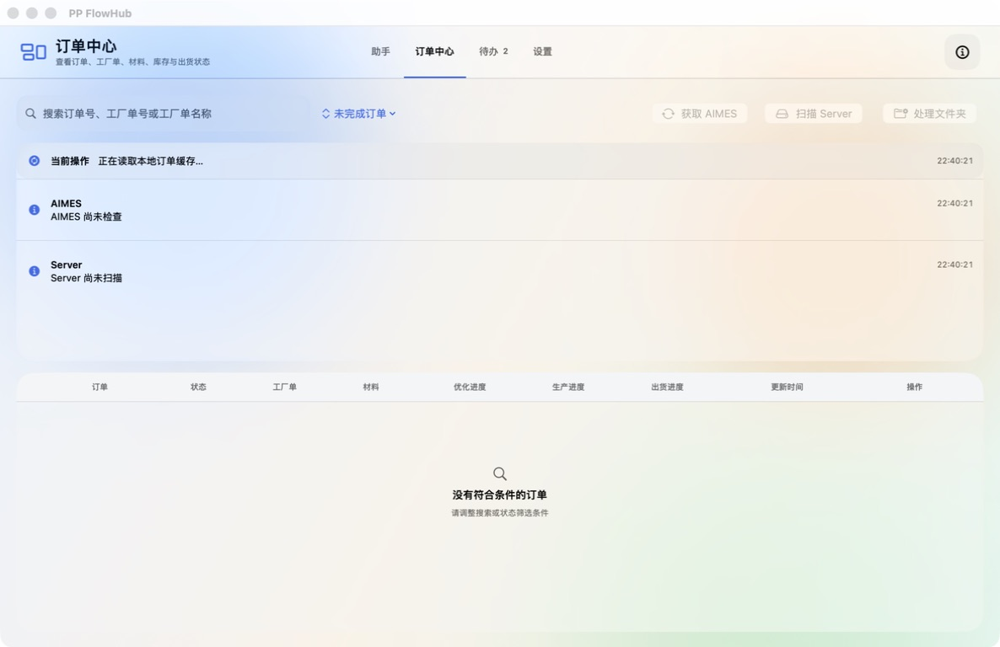
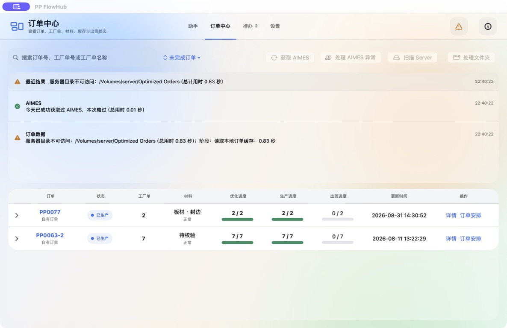
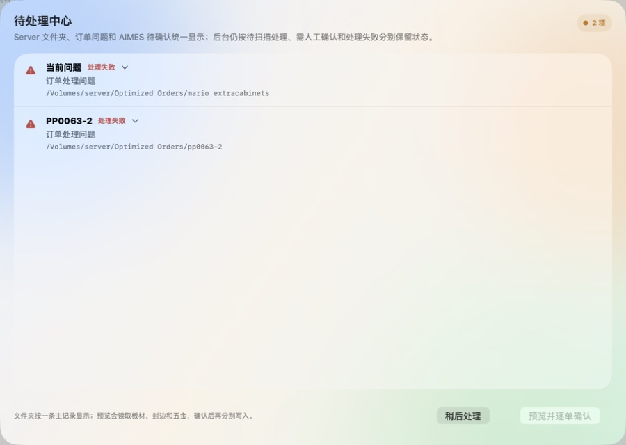
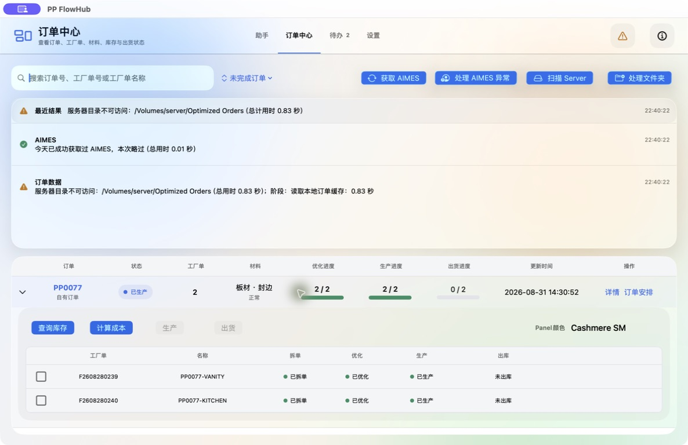
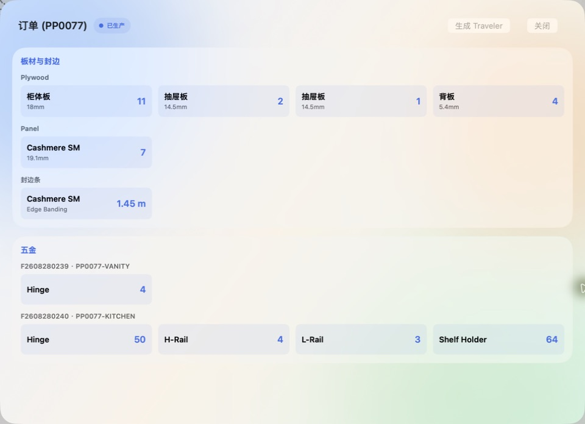

# Product Design 审查：订单中心主流程

审查日期：2026-08-31  
审查对象：已安装的 `/Applications/PP FlowHub.app` 订单中心  
审查目的：为后续 Product Design 设计探索确定真实页面结构、用户任务、状态和优先改进方向。

本次只进行界面观察、打开只读详情/库存查询界面和截图保存，没有点击“稍后处理”、生产、出货或任何确认写入按钮，也没有修改源代码。

## 1. 源码入口与实际用户路径

订单中心的 SwiftUI 入口是 `macos/OrderDashboardView.swift:1395` 的 `OrderDashboardView`。页面出现时执行：

```text
OrderDashboardView.body.onAppear
  → AppModel.startOrderDashboard()
  → AppModel.loadOrderDashboardCache()
  → runOrder(["list-index"])
  → applyDashboardObject(...)
  → 后台执行 AIMES / Server 检查
```

页面中的主要交互继续进入 `AppModel`：

```text
详情
  → detailOrder
  → OrderDashboardDetailPage

查询库存
  → AppModel.checkSelectedOrderStock()
  → runOrder(["stock-check", "--folder", selectedOrderPath])
  → Inventory / SQLite / 库存系统查询

生产
  → loadProductionPreview(...)
  → prepareProduction(...)
  → 用户确认后 startDirectProduction(...)

出货
  → 出库预检
  → 用户确认后执行 outbound
  → 回写出库状态并刷新订单列表
```

生产和出货的真实写入入口均在用户确认之后，Product Design 只能优化“理解、预览、确认和反馈”，不能改变这个安全边界。

## 2. 审查截图

### 步骤 1：首次打开，读取本地缓存



观察到：页面立即显示订单中心、搜索框、状态筛选和后台操作提示；订单列表暂时为空，顶部按钮处于不可用状态。

健康度：**基本良好，但等待状态还可以更明确**。

- 优点：用户知道正在读取本地订单缓存。
- 风险：列表为空时，用户可能误以为没有订单，而不是“仍在加载”。
- 设计建议：把“空列表”与“加载中”做成明显不同的状态，增加进度阶段或短说明。

### 步骤 2：本地缓存显示完成，后台检查失败



观察到：显示两个订单、AIMES 成功提示、Server 路径不可访问警告，以及优化、生产、出货进度。

健康度：**信息完整，但信息层级偏密集**。

- 优点：AIMES 成功、Server 失败、订单数据来源和耗时均有显示。
- 优点：订单行同时展示优化、生产、出货三个进度。
- 风险：顶部“最近结果”、AIMES、订单数据三条消息视觉权重接近，用户需要自己判断哪个最重要。
- 风险：`服务器目录不可访问` 与“仍可使用本地缓存”之间的关系不够突出。
- 设计建议：把“当前可操作性”作为第一层信息，例如“可使用本地缓存查看订单；Server 更新暂不可用”。

### 步骤 3：待处理中心



观察到：两个处理失败项目按主记录展示，底部说明“预览会读取板材、封边和五金，确认后再分别写入”。

健康度：**安全边界表达较好，但失败原因和下一步不足**。

- 优点：明确告诉用户预览和确认写入是分开的。
- 优点：没有把失败项目伪装成普通订单。
- 风险：列表中的“处理失败”缺少直接可见的失败原因和建议动作。
- 风险：用户需要展开项目后才能判断是否应重试、映射还是暂缓。
- 设计建议：每条项目增加“原因、影响、推荐下一步”三段式信息；保留“稍后处理”的低风险出口。

### 步骤 4：展开订单工厂单操作区域



观察到：订单行展开后显示“查询库存、计算成本、生产、出货”，并列出工厂单的拆单、优化、生产、出库状态。

健康度：**业务状态表达清晰，操作可用性需要进一步强化**。

- 优点：工厂单状态按列对齐，能够看出两个工厂单均已生产但未出库。
- 优点：生产和出货按钮根据状态禁用，避免非法操作。
- 风险：禁用按钮虽然安全，但用户需要依赖帮助文字才能理解为什么不能点。
- 风险：订单级进度和工厂单级进度同时出现，初学者可能混淆“订单已生产”和“工厂单已生产”的含义。
- 设计建议：在禁用按钮旁显示简短原因，例如“已生产，无可生产工厂单”；提供状态图例或悬停说明。

### 步骤 5：订单详情



观察到：详情页按“板材与封边”和“五金”分组，显示工厂单号、材料名称、规格和数量，并提供“生成 Traveler”和“关闭”。

健康度：**适合核对数据，但来源和下一步动作还可加强**。

- 优点：材料和五金按业务类别分组，数量易读。
- 优点：工厂单号与订单号同时显示，便于核对。
- 风险：用户不容易从页面判断这些数据来自哪个来源，以及是否已经经过材料校验。
- 风险：“生成 Traveler”是高影响动作，视觉上与“关闭”距离近，但缺少结果预告。
- 设计建议：增加“数据来源、校验状态、生成后会发生什么”摘要；高影响按钮增加确认前预览。

### 步骤 6：库存比对加载中


观察到：页面说明按订单汇总板材、封边和五金，中央显示正在查询材料库存，底部说明失败时可以再次查询。

健康度：**意图明确，但长时间等待反馈不足**。

- 优点：明确说明库存是按订单汇总，不按工厂单拆分。
- 优点：提前说明失败后可以重试。
- 风险：本次观察中页面持续处于加载状态，用户无法判断是正常等待、网络慢还是已卡住。
- 设计建议：显示当前阶段、已等待时长、最后更新时间和取消/关闭行为；如果超过阈值，切换为“仍在查询，可稍后重试”。

## 3. 优先级结论

### P0：先解决状态理解

订单中心最重要的问题不是颜色或圆角，而是用户要快速回答：

```text
现在发生了什么？
订单数据是否可信？
我现在能做什么？
下一步会不会写入真实系统？
```

### P1：重设计待处理中心

它连接 Server 失败、人工确认、材料映射和后续写入，是最适合使用 Product Design Ideate 的区域。建议生成三个方向：

1. 任务列表型：突出优先级和推荐动作。
2. 时间线型：突出扫描、预览、确认、写入的阶段。
3. 分层详情型：列表保持简洁，展开后展示原因、影响和数据变化。

### P2：优化长任务反馈

库存查询、AIMES、Server 扫描和出库都应统一采用：

```text
当前阶段 → 已耗时 → 下一阶段 → 可否取消/重试 → 最终结果
```

## 4. 下一次 Product Design 操作建议

将下面的设计简报直接交给 Product Design 的 Ideate 流程：

> 基于 PP FlowHub 当前订单中心和待处理中心，为 macOS 26 SwiftUI 设计三种视觉方向。必须保留本地缓存、AIMES、Server、订单数据、材料校验、等待确认、执行中、成功、失败等状态。重点优化用户对“当前发生什么、数据是否可信、下一步做什么、是否会真实写入”的理解。保留预览与确认写入的安全边界，使用项目现有的 macOS 原生布局和中文界面风格。

选定方向后，再做独立 SwiftUI 预览；通过 Design QA 确认视觉方案，最后才考虑修改生产页面。

## 5. 证据范围与限制

- 本次截图来自当前已安装 App 的真实运行状态。
- 当前环境无法访问 `/Volumes/server/Optimized Orders`，因此 Server 相关结论包含真实的不可访问状态，不代表所有生产环境都会失败。
- 库存比对在本次观察期间保持加载状态，因此只审查了加载态，没有声称库存结果页通过。
- 没有执行生产、出货、Server 确认或“稍后处理”，所以这些写入流程只根据源码入口和可见按钮进行审查。
- 截图和本报告用于 Product Design 的后续审查、设计探索和方案对比，不是业务数据正确性的替代验证。
