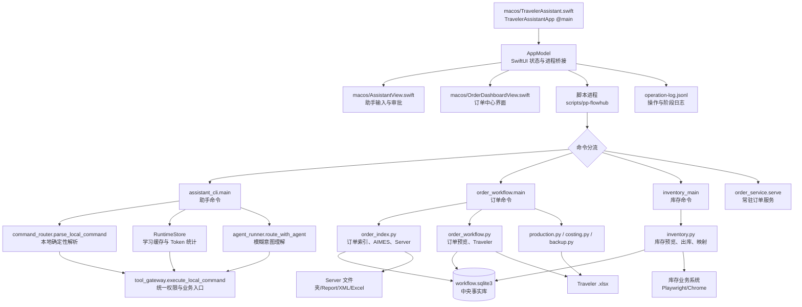
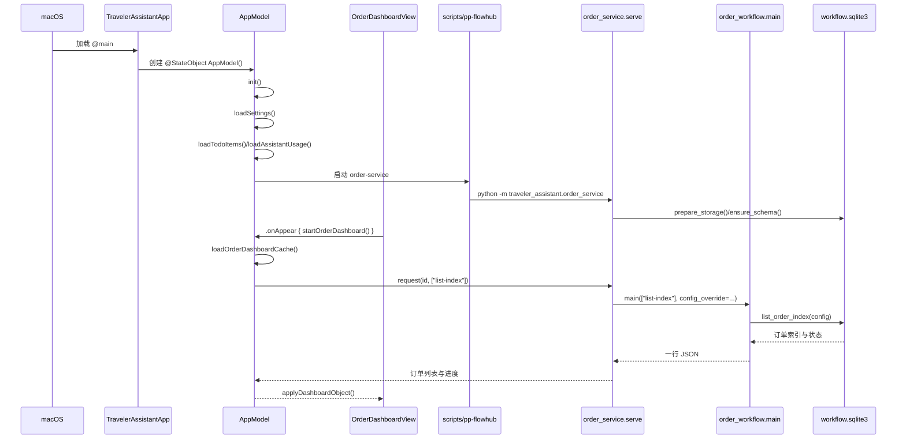
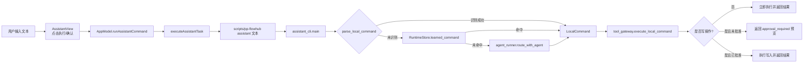
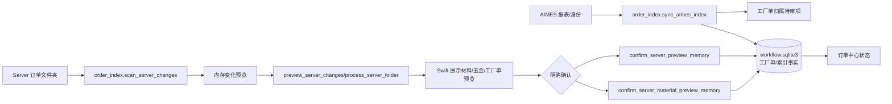
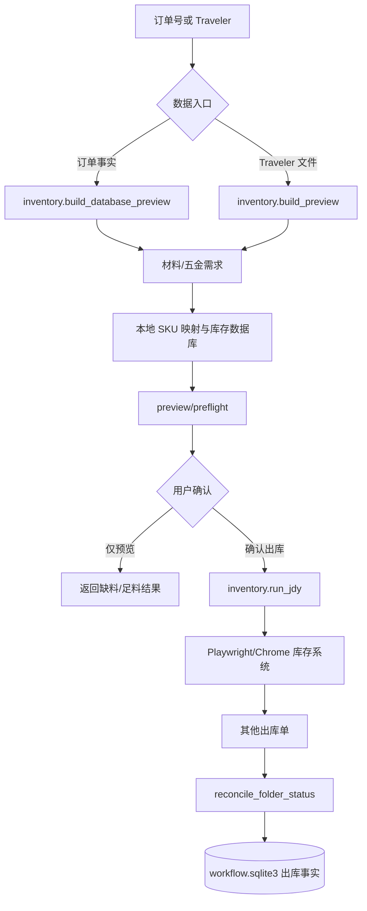

# PP FlowHub 结构图与入口调用链

> 目的：从真实源码出发，先看“谁启动谁、数据从哪里来、最后写到哪里”，再进入具体业务函数。
>
> 本文只新增学习文档，没有修改任何源码。函数名和文件名以当前源码为准；行号会随着后续开发变化，阅读时应以函数名为主。

## 1. 一张图看懂整体结构



核心边界是：SwiftUI 负责展示、输入、启动进程和接收 JSON；Python 负责业务规则、数据库、Excel、Server 和库存系统；`workflow.sqlite3` 是持久化业务事实源，Traveler 是生成出来的工作文件，不是唯一事实源。

## 2. App 启动调用链



### 启动时各函数的输入和输出

| 起点 | 传入参数 | 下一步 | 结果/副作用 |
|---|---|---|---|
| `TravelerAssistantApp.body` | 当前 `selection`、`AppModel` | 创建 `AssistantView`、`OrderDashboardView` 等 | 建立窗口和页面切换 |
| `AppModel.init()` | 无显式参数 | `loadSettings()`、日志初始化、待办/用量读取、`startResidentOrderService()` | 准备 App 状态和后台服务 |
| `OrderDashboardView.onAppear` | 当前 `model` | `model.startOrderDashboard()` | 只启动一次订单中心初始化 |
| `AppModel.loadOrderDashboardCache()` | 无显式参数 | `runOrder(["list-index"])` | 先显示 SQLite 本地缓存，再继续后台同步 |
| `AppModel.runOrder(_ arguments: [String], input: Data? = nil, ...)` | 命令数组、可选 JSON 输入、失败处理和完成回调 | 常驻服务 `request()` 或启动 `scripts/pp-flowhub order` | 读取 JSON、消费 stderr 进度、更新 SwiftUI 状态和操作日志 |
| `order_service.serve()` | stdin 中的 NDJSON 请求 `{id, arguments, input_base64?}` | `order_workflow.main(...)` | 复用 SQLite 连接，返回一行 JSON |
| `order_workflow.main(argv, config_override, ...)` | 命令名、订单号、路径、确认开关等 CLI 参数 | 根据命令调用 `order_index`、`order_workflow`、`production` 等函数 | 产生结构化结果或 `fatal` 错误 |

## 3. 助手命令调用链



关键安全点：Agent 只能帮助理解模糊意图，不能直接决定写入；所有路径最终都经过 `tool_gateway.execute_local_command()`，由 Gateway 重新判断是否需要审批。

典型例子“查看 PP0035”：

1. `AssistantView` 调用 `AppModel.runAssistantCommand(approved: false)`。
2. `executeAssistantTask()` 启动 `scripts/pp-flowhub assistant "查看 PP0035"`。
3. `assistant_cli.main()` 先调用 `parse_local_command()`。
4. `command_router.parse_local_command()` 返回 `LocalCommand(action="preview_order", arguments={"order_id":"PP0035"}, requires_approval=false)`。
5. `execute_local_command()` 调用 `_order_folder()` 找订单目录，再调用 `preview_order()`。
6. `preview_order()` 读取订单目录中的材料/工厂资料，结果经 JSON 返回 Swift。
7. Swift 将 JSON 映射到 `assistantOrderPreview`，页面只展示结果，不写数据库。

典型写操作“生成 Traveler”：

1. 前 4 步相同，但 action 是 `generate_traveler`。
2. Gateway 第一次调用 `preview_order()`，返回 `status=approval_required`。
3. 用户点击确认后，Swift 再次传入相同任务和 `--approve`。
4. Gateway 调用 `generate_order_traveler()`，生成 `.xlsx`，必要时保存数据库记录。

## 4. 订单中心主要调用链

```mermaid
flowchart TD
    A[OrderDashboardView\n选择订单/点击动作] --> B[AppModel.prepareSelectedOrder]
    B --> C[runOrder(["detail", "--order-id", id])]
    C --> D[order_workflow.main]
    D --> E[order_details.order_detail]
    E --> F[(workflow.sqlite3)]
    E --> G[Server/Traveler/库存事实]
    F --> H[applyDashboardObject/applyOrderDetail]
    G --> H

    H --> I{用户动作}
    I --> J[生成 Traveler]
    I --> K[生产预览/准备]
    I --> L[库存预览/出库]
    I --> M[成本计算/导出]

    J --> N[order_workflow.generate_order_traveler]
    K --> O[production.production_preview/prepare_production]
    L --> P[inventory.build_database_preview/run_jdy]
    M --> Q[costing.calculate_order_cost/export_order_cost]

    N --> R[Traveler .xlsx]
    O --> S[生产数据库事实]
    P --> T[库存系统单据/出库事实]
    Q --> U[成本 JSON/Excel]
```

## 5. Server 与 AIMES 数据流



扫描、预览、确认是三个不同阶段：扫描可以发现变化；预览计算将要写入的内容；只有确认函数才写入中央数据库。`scan_server_changes()` 不等于“把所有 Server 文件直接变成生产事实”。

## 6. 库存与出库数据流



库存查询是只读路径；真实出库是独立的确认写入路径。不要把“生成 Traveler”“库存预览”“实际出库”理解成一个函数或一个事务。

## 7. 数据从哪里来，最后到哪里去

| 数据 | 读取来源 | 主要处理函数 | 最终去向 |
|---|---|---|---|
| 订单文件夹、Report、XML | `/Volumes/server/Optimized Orders`、`CUT TO SIZE` | `scan_server_changes`、`preview_order` | SQLite 订单索引/材料事实；部分作为证据记录 |
| AIMES 工厂单 | AIMES 查询或缓存文件 | `sync_aimes_index` | SQLite 工厂单身份、待审核归属 |
| 中央业务事实 | `data/workflow.sqlite3` | `list_order_index`、`order_detail`、库存/生产函数 | 订单中心、库存预览、生产和成本计算 |
| Traveler | `runtime/travelers/*.xlsx` 或选定路径 | `build_preview`、`generate_order_traveler` | 预览结果或新 `.xlsx` 工作文件 |
| 商品/SKU | 本地商品目录、映射表、库存系统 | `bootstrap_product_database`、`search_inventory_products` | 本地 SKU 映射与库存请求 |
| 用户确认 | SwiftUI 按钮和 CLI `--confirm-write/--approve` | Gateway、`confirm_*`、`run_jdy` | 允许产生数据库事实、Traveler 或出库单 |
| 操作进度 | Swift/Python stderr 和 JSONL | `OperationLogWriter`、`operation_log` | `data/operation-log.jsonl` 与页面进度条 |

## 8. 学习顺序：从入口开始

### 第一步：只看启动，不看业务细节

先读以下 5 个位置：

1. `macos/TravelerAssistant.swift`：`TravelerAssistantApp` 和 `AppModel.init()`。
2. `macos/OrderDashboardView.swift`：`.onAppear { model.startOrderDashboard() }`。
3. `macos/TravelerAssistant.swift`：`runOrder()`，理解 Swift 如何启动后台命令并读取 JSON。
4. `scripts/pp-flowhub`：理解四种命令如何进入 Python 模块。
5. `traveler_assistant/order_service.py`：理解常驻服务如何把请求交给 `order_workflow.main()`。

此时你应该能回答：窗口是谁创建的？订单列表第一次来自哪里？Swift 和 Python 如何传参数？Python 返回什么格式？

### 第二步：跟一条最短业务链

建议先跟“查看订单详情”，因为它不涉及写入：

`OrderDashboardView` → `prepareSelectedOrder` → `runOrder(["detail", "--order-id", id])` → `order_workflow.main` → `order_details.order_detail` → SQLite → Swift 状态。

阅读每个函数时固定记录四项：

- 输入：参数和来源；
- 输出：返回值或 JSON 字段；
- 副作用：数据库、文件、网络、日志、UI 状态；
- 不变量：例如未确认前不能写入，Traveler 不是唯一事实源。

### 第三步：再学习有审批的写入链

依次学习 Server 确认、生成 Traveler、实际出库。每条链都要把“预览”和“确认”分开画出来，因为它们的权限、写入和失败恢复方式不同。

### 第四步：用日志验证自己的理解

一次操作后检查 `data/operation-log.jsonl`：用同一个 `operation_id` 把 App 点击、后台阶段、Python 命令和最终结果串起来。日志能验证“实际走了哪条路径”，比只看函数名可靠。

## 9. 已确认事实与阅读边界

- 已确认：入口是 `TravelerAssistantApp @main`；订单中心通过 `AppModel` 调用 `scripts/pp-flowhub`；订单常驻服务最终调用 `order_workflow.main()`。
- 已确认：助手命令最终统一进入 `tool_gateway.execute_local_command()`；写操作需要第二次批准。
- 已确认：中央 SQLite 是持久化业务事实源；Server、AIMES、Traveler、库存系统是不同数据边界。
- 合理推测：某些后台同步是否实际访问外部 Server/AIMES，取决于当前配置、缓存和网络状态；应结合当次操作日志确认。
- 未验证假设：本文没有点击所有页面按钮，也没有为每个异常分支逐一做现场演练；异常路径应结合对应测试和日志继续学习。

相关深入文档：

- [完整架构与业务流](/Users/lantian/Documents/pp-flowhub/docs/learning/01-complete-architecture-and-business-flow.md)
- [接手学习指南](/Users/lantian/Documents/pp-flowhub/docs/learning/04-handoff-guide.md)
- [用户操作调用链全集](/Users/lantian/Documents/pp-flowhub/docs/learning/09-user-operation-call-chains.md)
- [Python 函数索引](/Users/lantian/Documents/pp-flowhub/docs/learning/06-python-symbol-reference.md)
- [Swift 符号索引](/Users/lantian/Documents/pp-flowhub/docs/learning/07-swift-symbol-reference.md)
