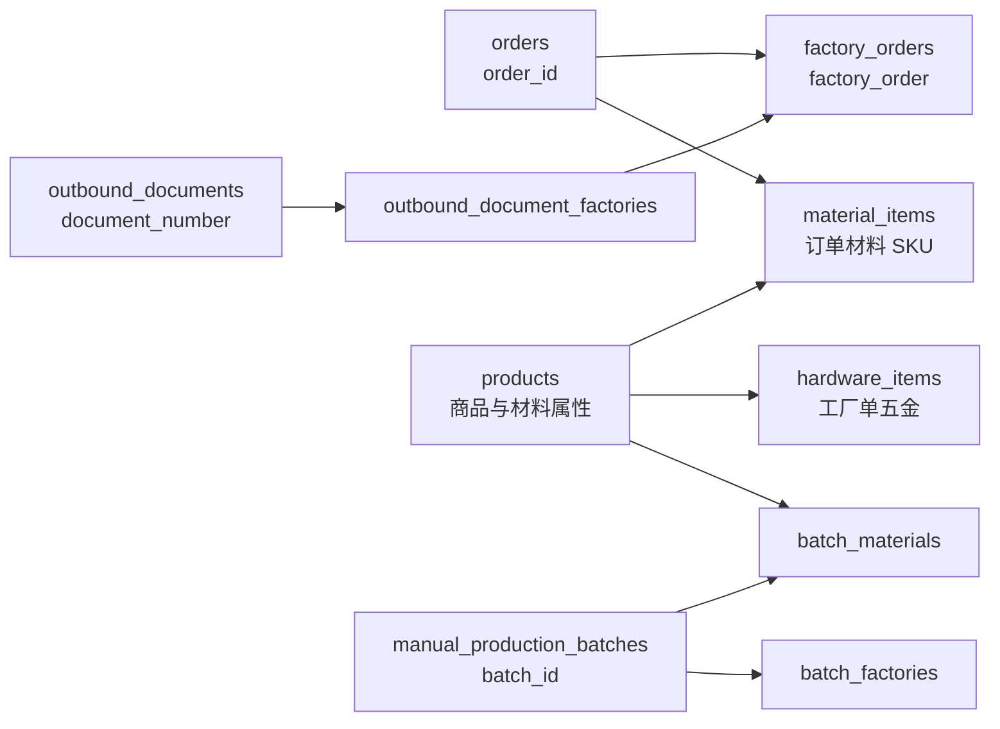

# 学习：把外部数据保存到 PP FlowHub 的 SQLite

这篇说明回答一个实际问题：已经有一个读取 WeCom SmartSheet 的 Python 模块，下一步想把整理后的记录保存到 PP FlowHub 数据库，是否需要重新设计一套数据库连接基础设施？

先给结论：项目已经有统一的数据库文件路径、schema 初始化入口和应用连接辅助函数。独立同步入口使用 `Config.workflow_database` 得到路径；参与商品 SKU 外键表写入/事务的连接，应通过 `connect_database(path)` 打开，或在事务开始前对借用连接调用 `enable_foreign_keys(connection)`。只读 `mode=ro`、SQLite backup 和内存克隆等非业务写连接仍可直接使用 `sqlite3.connect`。保存函数更适合显式接收调用方传入的 `connection`，由调用方决定事务边界、提交、回滚和关闭。这样既能把一次同步中的多个写入放进同一个短事务，也不会让底层函数误关闭或误提交借来的连接。

这篇文档只讲数据库学习和设计边界。下面的教学表名、记录和示例数据都是虚构的，不是现有业务表，也不会访问 WeCom 或真实数据库。

## 1. 先理解四个对象

SQLite 是一个嵌入式关系数据库。它不需要单独运行数据库服务器，数据通常保存在一个 `.sqlite3` 文件中。PP FlowHub 的中央业务文件是 `workflow.sqlite3`。

连接（`sqlite3.Connection`）代表 Python 进程和某个 SQLite 文件之间的一次打开状态。一个连接可以执行多条 SQL，也可以开始、提交或回滚事务。连接还保存一些运行时状态，例如是否处于事务中。

游标（`sqlite3.Cursor`）是执行 SQL 后逐行读取结果的对象。项目大多数地方直接使用 `connection.execute(...)`；SQLite 会返回一个可迭代的游标，因此不需要每条 SQL 都手工创建游标。

事务是一组要一起成功或一起撤销的写入。`commit()` 使当前事务永久生效，`rollback()` 撤销尚未提交的写入。同步多个记录时，通常应让同一批记录使用同一个连接和同一个事务。

`row_factory` 决定查询结果的形状。默认结果像元组，可以使用 `row[0]`；设置 `connection.row_factory = sqlite3.Row` 后，可以使用 `row["order_id"]`。项目只在需要按列名读取的局部连接上设置它，没有一个全局连接配置。

## 2. 项目中的数据库路径和初始化

真实默认配置来自 `traveler_assistant/core.py`：`Config.state_dir` 是
`Path.home() / "Documents/pp-flowhub/data"`，`Config.workflow_database` 调用
`database_path(self.state_dir)`，而 `database_path(state_dir)` 返回
`state_dir / "workflow.sqlite3"`。因此默认文件路径是
`~/Documents/pp-flowhub/data/workflow.sqlite3`。

这里的 `~` 代表当前 macOS 用户的 Home 目录。`state_dir` 可以在创建 `Config` 时显式传入，测试也可以使用临时目录；实际路径取当前 `config.workflow_database`。业务代码不应硬编码这个绝对路径。

完整签名是 `database_path(state_dir: Path) -> Path` 和
`ensure_schema(path: Path) -> None`。前者参数是状态目录并返回数据库文件路径，后者参数是数据库文件路径，不是目录。例如：

```python
ensure_schema(config.workflow_database)
```

传入目录会让 `sqlite3.connect(path)` 把目录当成数据库文件，不能得到正确结果。

`ensure_schema` 会创建父目录、通过 `connect_database` 打开自己的临时连接、创建或事务升级它负责的业务表、提交并关闭这个连接。当前升级包括把旧材料属性行唯一解析为商品 SKU，再迁移订单材料、生产消耗和 Server 分配；不能唯一匹配或出现孤儿 SKU 时会回滚并报出诊断。它不是一个“返回已经打开连接”的函数。

```python
from traveler_assistant.database import connect_database

connection = connect_database(config.workflow_database)
try:
    connection.execute("begin immediate")
    # 在同一事务中执行相关写入
    connection.commit()
except Exception:
    connection.rollback()
    raise
finally:
    connection.close()
```

SQLite 的 `REFERENCES` 不会自动保证每条连接都执行约束。`PRAGMA foreign_keys=ON` 在事务开始后执行没有效果，所以 `enable_foreign_keys` 遇到“事务已经开始但外键仍关闭”的借用连接会直接报错；调用方要先启用外键，再 `BEGIN`。

`Config.prepare_storage()` 是正常应用准备存储的入口。它先进行数据库与 Server 来源隔离检查，再把 `storage_prepared` 设为 `True`，最后调用 `ensure_schema(...)`。因此它有目录、隔离检查和 schema 写入副作用，不能把它当成纯读取函数。

旧数据迁移要和正常启动升级区分开：

- `migrate_inventory_mapping_file(state_dir)` 负责一次性把旧库存映射 JSON 迁入中央库，并在提交成功后归档旧文件。
- `migrate_legacy_databases(state_dir)` 负责把旧订单库、出库 JSON 和缓存 JSON 合并到中央库，并在提交成功后归档来源。
- `ensure_schema(path)` 负责当前数据库的建表和原位 schema/行结构升级；它不负责从旧数据库文件、JSON 或外部系统导入业务数据。

当前正常启动的 `prepare_storage()` 只调用 `ensure_schema()`；不要根据旧学习资料把它描述成每次启动都会重新迁移旧文件。

## 3. API 速查

| 入口 | 签名或形式 | 作用 | 连接/事务行为 |
| --- | --- | --- | --- |
| [`database_path`](../../traveler_assistant/database.py) | `database_path(state_dir: Path) -> Path` | 从状态目录得到 `workflow.sqlite3` | 不打开连接 |
| `connect_database` | `connect_database(path, **kwargs) -> Connection` | 打开应用 SQLite 连接并启用外键 | 返回调用方拥有的连接 |
| `enable_foreign_keys` | `enable_foreign_keys(connection) -> Connection` | 检查并启用借用连接的外键约束 | 必须在事务开始前调用 |
| [`ensure_schema`](../../traveler_assistant/database.py) | `ensure_schema(path: Path) -> None` | 创建和升级中央 schema | 自己连接、提交、关闭 |
| [`Config.workflow_database`](../../traveler_assistant/core.py#L154) | property | 获取当前配置对应的中央库路径 | 不打开连接 |
| [`Config.prepare_storage`](../../traveler_assistant/core.py#L162) | `prepare_storage() -> None` | 隔离检查并准备中央库 | 有目录和 schema 写入副作用 |
| [`OrderIndexStore`](../../traveler_assistant/order_index.py#L703) | `OrderIndexStore(path, connection=None)` | 订单索引读写对象 | 未传连接时可能自行打开；传入连接时借用 |
| [`OrderIndexStore.commit`](../../traveler_assistant/order_index.py#L2165) | `commit() -> None` | 提交 Store 当前连接事务 | 会提交当前连接 |
| [`install_shared_workflow_connection`](../../traveler_assistant/order_index.py#L70) | `(path, connection) -> None` | 常驻订单服务注册共享连接 | 只服务特定常驻订单路径 |
| [`write_cache`](../../traveler_assistant/database.py#L847) | `write_cache(path, cache_name, value) -> None` | 写入通用业务缓存 | 自己连接、提交、关闭 |
| [`InventoryMappings`](../../traveler_assistant/inventory.py#L1835) | `InventoryMappings(path, connection=None)` | 读取库存映射规则 | 读取可借用连接；部分写方法自行连接 |
| [`record_completed_production`](../../traveler_assistant/production.py#L430) | `(connection, draft) -> dict` | 写入已完成生产事实 | 接收连接，只执行写入，不自行提交 |

`Config.workflow_connection` 默认值是 `None`。现有调用者会把它显式传给 `OrderIndexStore`、`InventoryMappings` 等对象；预览流程还会把内存 SQLite 连接注入 `stage_config.workflow_connection`。它不是自动创建连接的函数，不能假设它一定有值。相关入口见 [`core.py#L142`](../../traveler_assistant/core.py#L142)、[`order_index.py#L6416`](../../traveler_assistant/order_index.py#L6416)、[`order_index.py#L8640`](../../traveler_assistant/order_index.py#L8640) 和 [`order_workflow.py#L1908`](../../traveler_assistant/order_workflow.py#L1908)。

这个字段与 `install_shared_workflow_connection` 的常驻全局注册机制是两件事。传入借用连接时，调用方仍拥有事务和生命周期；现有 `OrderIndexStore.commit()` 会提交它持有的连接，因此不要把“借用连接不得擅自提交”误写成全项目已经强制的行为，那是新存储函数应遵循的边界。

## 4. 当前 schema 的主要分类

`ensure_schema` 负责中央库中的业务事实、来源、缓存和库存相关表；订单索引对象 `OrderIndexStore` 负责订单索引表及其一次性索引 schema 初始化。不要说 `ensure_schema` 单独创建了所有订单表。

代表性表和关系如下：

| 分类 | 代表性表 | 关键身份或关系 |
| --- | --- | --- |
| 订单索引 | `orders` | `order_id` 主键 |
| 工厂单索引 | `factory_orders` | `factory_order` 主键，通过 `order_id` 指向订单 |
| 来源文件 | `source_files` | `path` 主键，保存来源文件和订单/工厂单身份 |
| 商品主资料 | `products` | `code` 是 SKU；原始目录字段与材料类型/颜色/名义厚度同层保存，`catalog_present` 标记是否仍在最新目录 |
| 订单材料 | `material_items` | 以 `order_id`、`product_code`、来源类型和路径保存 SKU 数量事实；属性读取自 `products` |
| 工厂单五金 | `hardware_items` | `product_code` 是规范 SKU；通过 `order_id`、`factory_order` 归属工厂单，并保留来源名称/编码/规格/单位 |
| 生产批次 | `manual_production_batches` | `batch_id`/`batch_number` 表示一次生产记录 |
| 生产关联 | `manual_production_batch_factories`、`manual_production_batch_materials` | 通过 `batch_id` 关联工厂单；消耗材料按 `product_code` 保存数量 |
| Server 材料分配 | `server_material_allocations` | 保存来源路径/指纹、来源数量、订单分配数量和规范 SKU |
| 库存映射 | `inventory_resolution_rules` | mapping 行用外键引用 SKU；ignore 行明确使用 `NULL` |
| 出库单据 | `outbound_documents` | `document_number` 表示外部出库单据 |
| 出库关联 | `outbound_document_factories` | 通过 `document_number` 把一个出库单关联到一个或多个工厂单 |
| 外部操作恢复 | `inventory_operations` | 保存操作意图、指纹、尝试状态和外部结果 |
| 元数据和缓存 | `workflow_metadata`、`business_cache` | 迁移标记、缓存值和更新时间 |

订单材料生产消耗和工厂单出货是两个业务事实。`outbound_documents` 可能记录生产领料或工厂单出货，需结合用途和关联类型判定，不能仅凭存在该表记录就判断已经出货；实际字段包括 `document_type`、`source`、`order_id` 和 `factory_order`。生产批次关联材料消耗；生产消耗不能自动证明工厂单已经出货，设计同步字段时应保持这两个事实分开。



图中只表示身份关系和业务边界，不表示所有表都由外部同步直接写入。

这里的商品箭头对应 SQLite 外键。`material_items`、`manual_production_batch_materials`、`server_material_allocations`、`hardware_items` 和 mapping 规则都引用 `products(code)`；商品目录缺少已引用 SKU 时保留商品行并设 `catalog_present=0`，而不是删除父行。`ON DELETE RESTRICT` 保护历史引用，`ON UPDATE CASCADE` 只保护显式 SKU 主键更新；业务流程通常不应随意改 SKU。

## 5. WeCom 同步应该怎样分层

建议把外部命令、字段整理和数据库写入分成三层：

```text
wecom_service
  → 调用 wecom-cli，读取 JSON，处理外部错误
同步层
  → 校验字段、规范化订单号和日期、决定新增/更新/删除语义
存储函数(connection, normalized_records)
  → 只执行参数化 SQL，不决定连接所有权，不自行提交
调用方事务
  → commit 成功；异常 rollback；finally close 自己拥有的连接
回读验证
  → 查询已提交结果，验证数量和关键身份
```

外部 API 调用应先完成，再开启短的本地数据库事务。这样网络等待不会长时间占用 SQLite 写锁。外部调用成功也不等于本地写入成功；两者要分别记录结果并分别验证。

存储函数显式接收 `connection` 的好处是调用者可以把多张表的写入放在同一事务中。例如，未来如果一次同步同时更新主记录和同步元数据，调用者可以决定它们必须一起成功。存储函数不要擅自调用 `commit()`，否则调用者失去组合多个写入的能力。

连接所有权要说清楚：

- 函数内部自己 `sqlite3.connect(...)` 的连接，由该函数负责 `commit`/`rollback` 和 `finally: close()`。
- 调用方传入的连接是借用连接，底层函数不得擅自 `close()`，也不应擅自 `commit()`。
- Python 的 `with connection:` 上下文管理器会在离开时提交或回滚事务，但不会替你关闭连接；仍要在拥有连接的地方执行 `close()`。

## 6. 隔离教学示例

下面的代码可以单独运行。它只创建临时目录和临时 SQLite 文件，并定义教学专用表 `learning_wecom_records`。这个表不是现有 schema 的一部分；两个字典也是已经规范化的虚构输入，与真实 CLI 返回结构无关。

```python
from pathlib import Path
from tempfile import TemporaryDirectory
import sqlite3

from traveler_assistant.database import database_path, ensure_schema


def save_records(connection: sqlite3.Connection, records: list[dict]) -> None:
    """教学存储函数：只执行 SQL，事务由调用方负责。"""
    connection.executemany(
        """
        insert into learning_wecom_records(
            doc_id, sheet_id, record_id, order_id, order_status, note
        ) values (?, ?, ?, ?, ?, ?)
        on conflict(doc_id, sheet_id, record_id) do update set
            order_id = excluded.order_id,
            order_status = excluded.order_status,
            note = excluded.note
        """,
        [
            (
                item["doc_id"],
                item["sheet_id"],
                item["record_id"],
                item["order_id"],
                item["order_status"],
                item["note"],
            )
            for item in records
        ],
    )


def run_demo() -> None:
    normalized_records = [
        {
            "doc_id": "demo-doc",
            "sheet_id": "orders",
            "record_id": "row-001",
            "order_id": "PP-DEMO-001",
            "order_status": "进行中",
            "note": "教学记录一",
        },
        {
            "doc_id": "demo-doc",
            "sheet_id": "orders",
            "record_id": "row-002",
            "order_id": "PP-DEMO-002",
            "order_status": "待确认",
            "note": "教学记录二",
        },
    ]

    with TemporaryDirectory() as directory:
        state_dir = Path(directory) / "state"
        database = database_path(state_dir)
        ensure_schema(database)
        connection = sqlite3.connect(database)
        try:
            connection.execute(
                """
                create table learning_wecom_records(
                    doc_id text not null,
                    sheet_id text not null,
                    record_id text not null,
                    order_id text not null,
                    order_status text not null,
                    note text not null default '',
                    primary key(doc_id, sheet_id, record_id)
                )
                """
            )
            connection.commit()

            connection.execute("begin")
            save_records(connection, normalized_records)
            connection.commit()
            first_count = connection.execute(
                "select count(*) from learning_wecom_records"
            ).fetchone()[0]
            assert first_count == 2

            # 同一批记录再次保存时更新已有行，数量保持不变。
            updated_records = [
                {**normalized_records[0], "note": "教学记录一（已更新）"},
                normalized_records[1],
            ]
            connection.execute("begin")
            save_records(connection, updated_records)
            connection.commit()
            second_count = connection.execute(
                "select count(*) from learning_wecom_records"
            ).fetchone()[0]
            assert second_count == first_count == 2
            updated_note = connection.execute(
                "select note from learning_wecom_records where record_id=?",
                ("row-001",),
            ).fetchone()[0]
            assert updated_note == "教学记录一（已更新）"

            # 故意让第二行违反 NOT NULL，验证整批写入回滚。
            before_failed_batch = second_count
            try:
                connection.execute("begin")
                save_records(
                    connection,
                    [
                        {
                            "doc_id": "demo-doc",
                            "sheet_id": "orders",
                            "record_id": "row-003",
                            "order_id": "PP-DEMO-003",
                            "order_status": "进行中",
                            "note": "会被回滚",
                        },
                        {
                            "doc_id": "demo-doc",
                            "sheet_id": "orders",
                            "record_id": None,
                            "order_id": "PP-DEMO-004",
                            "order_status": "进行中",
                            "note": "故意失败",
                        },
                    ],
                )
                connection.commit()
            except sqlite3.Error:
                connection.rollback()
            after_failed_batch = connection.execute(
                "select count(*) from learning_wecom_records"
            ).fetchone()[0]
            assert after_failed_batch == before_failed_batch == 2
        except sqlite3.Error:
            connection.rollback()
            raise
        finally:
            connection.close()


if __name__ == "__main__":
    run_demo()
```

这个示例展示了三个关键点：唯一键 `(doc_id, sheet_id, record_id)` 提供幂等身份；参数化 SQL 把值和 SQL 结构分开；`save_records` 不拥有事务，调用方才负责提交、回滚和关闭。示例中的 `ensure_schema(database)` 会初始化临时库，但不会访问项目运行时的真实 `data/`。

## 7. 正式开发前必须确定的业务规则

在真正写同步功能之前，还需要确认这些问题：

1. WeCom 字段如何映射到项目字段？例如 WeCom 的订单号、状态、取货日期和备注分别对应哪种事实；哪些字段必须保留原始值和来源。
2. `wecom-cli smartsheet records list` 单次最多 1000 条，且 `limit × 列数 < 10000`。`get_records()` 用 `has_more` / `next_cursor` 翻页，把各页拼成一份 `records`；调用方不要再传 `limit=100` 当成总上限。
3. 外部记录被修改或删除时，中央库是覆盖、标记失效、保留历史，还是只追加新的观察结果。
4. 幂等键到底是 `(doc_id, sheet_id, record_id)`，还是还需要租户、版本或来源快照；重复同步如何保证不会重复创建业务事实。
5. WeCom 数据是否只能更新独立的同步表，不能覆盖 Server/AIMES 已确认的订单、工厂单、材料或五金事实。

现有 `docs/business-rules.md` 说明当前版本没有启用 WeCom `Order Management` 自动同步，手工智能表格也不是当前版本官方 API 数据源。这是当前范围记录，不等于以后用户明确提出新版本同步需求时永久禁止扩展；届时应先确认字段和事实边界，再同步更新业务规则与交接记录。

## 8. 当前 WeCom 模块状态

当前 [`traveler_assistant/wecom_service.py`](../../traveler_assistant/wecom_service.py) 有两个读取入口：`get_smartsheet_info(doc_url)` 和 `get_records(doc_url, sheet_id)`；没有写入入口。`get_records` 会按页循环读取直到没有更多记录。底层 `_run_wecom_command(args)` 负责运行 `wecom-cli`、解析 JSON 和抛出外部命令错误。

旧版本曾记录模块导入时的 `NameError` 诊断；当前示例逻辑已经位于 `__main__` 保护块内，项目虚拟环境的 Python 语法检查可通过。该检查不代表真实 WeCom、权限、网络或生产数据库验收。当前模块仍只有读取和字段整理能力，未接入正式 App 链路或自动同步；后续若扩展，仍需先确认字段、事实边界和幂等键。

## 9. 建议的源码阅读顺序

可以按下面的顺序在项目中跟读：

1. 先读 [`core.py`](../../traveler_assistant/core.py) 的 `Config`，理解 `state_dir`、`workflow_database` 和 `prepare_storage()`。
2. 再读 `database.py` 的 `database_path`、`connect_database`、`enable_foreign_keys` 和 `ensure_schema`，区分“路径”“连接运行时约束”和“schema 升级”。
3. 读 [`order_index.py`](../../traveler_assistant/order_index.py) 的 `OrderIndexStore`，确认订单/工厂单建表职责和可选的显式连接传递。
4. 读 [`order_service.py`](../../traveler_assistant/order_service.py) 的 `serve()`，理解常驻服务如何打开并注册一条共享连接。
5. 读 [`production.py`](../../traveler_assistant/production.py) 的 `record_completed_production`，观察“函数接收 connection、调用方决定事务”的写法。
6. 最后回到 `wecom_service.py`，只把外部读取结果转换为已经规范化的字典，再交给独立同步层和存储函数。

纯文档修改的基本检查是 `git diff --check`。如果以后修改 WeCom 模块，先对隔离输入做单元测试，并用 stub 替代真实 `wecom-cli`；不要把一次语法检查或临时库示例当成真实 WeCom 和生产数据库验收。

需要查看 2026-09-12 迁移前运行库的完整字段、类型、可空、默认值、约束和源码证据时，参见[历史数据库字段快照](database-map/current-schema.md)；当前文件角色、SKU 关系和字段核对方法见[数据库地图](12-database-map.md)。
